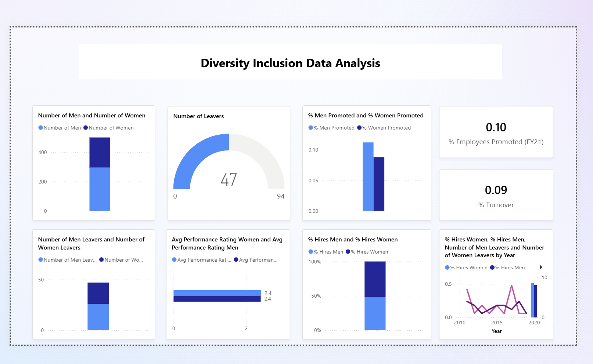
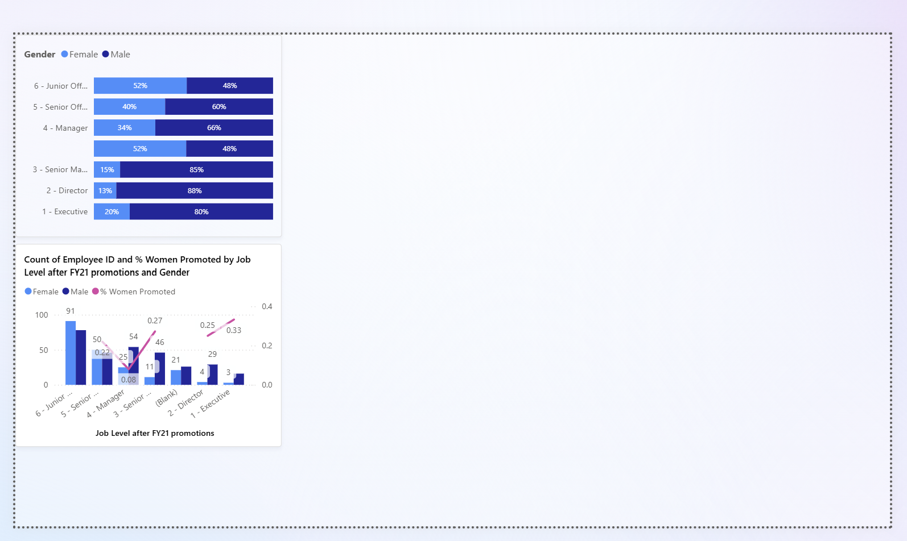

# 📊 Diversity & Inclusion Data Analysis (Power BI)

This repository contains an interactive **Diversity & Inclusion Data Analysis Dashboard** built using Power BI.  
The report provides insights into workforce distribution, promotions, hiring patterns, performance ratings, and turnover, helping organizations evaluate gender representation and inclusivity across job levels.

## 🚀 Key Features

- **Workforce Composition** – number of men vs women across the organization  
- **Number of Leavers** – overall turnover and gender-specific exits  
- **Promotion Analysis** – % of men promoted vs % of women promoted  
- **Performance Ratings** – average rating comparison between men and women  
- **Hiring Insights** – gender distribution in new hires  
- **Turnover & Promotion KPIs** – quick metrics for % promoted and % turnover  
- **Yearly Trends** – hires, leavers, and gender patterns over time  
- **Job Level Breakdown** – representation of men and women at each level  
- **Promotion by Level** – employee count and % women promoted by job level  

## 🖼️ Dashboard Preview

_(Upload your screenshots to the repo and update the paths below.)_

  

## 🗂️ File Included
- **Diversity Inclusion Data.pbix** – complete Power BI report with data model, visualizations, and DAX measures.

## 🛠️ Technologies Used
- Power BI Desktop  
- Power Query for data cleaning and shaping  
- DAX for KPIs and analytical metrics  
- Data modeling using star-schema principles  

## 📦 How to Use
1. Download **Diversity Inclusion Data.pbix**.  
2. Open it in Power BI Desktop (latest version recommended).  
3. Interact with filters and visuals to explore insights.  
4. Connect your own dataset if you want to refresh or customize the report.

## 📈 Ideal For
- HR Analytics  
- Diversity & Inclusion Reporting  
- Employee Lifecycle & Workforce Insights  
- Organizational Performance Dashboards  

## 🔮 Future Enhancements
- Add drill-through pages for department-level insights  
- Introduce AI visuals for anomaly detection  
- Publish to Power BI Service with scheduled refresh  
